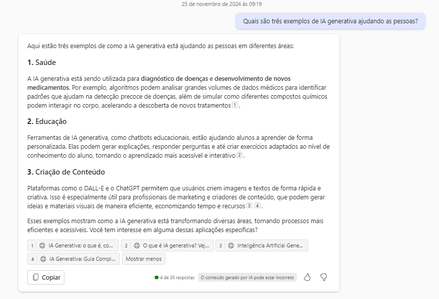

<h1>Explorando os Recursos de IA Generativa com Copilot e OpenAI</h1>


<h3>Repositório criado para o desafio do bootcamp Microsoft - Fundamentos de IA</h3>

<p align="justify">
    Este projeto tem como objetivo demonstrar o uso prático de ferramentas de IA generativa, como o Microsoft Copilot e OpenAI, em diferentes contextos, incluindo interação textual, geração de imagens, criação de código e exemplos de impacto no mundo real.
</p>

<h4 align="justify">Descrição do projeto</h4>

<p align="justify">
   A proposta deste projeto é explorar os recursos de IA generativa por meio de prompts e registrar os resultados obtidos, visando aprender como essas tecnologias podem ser aplicadas para resolver problemas ou criar soluções inovadoras. Este repositório contém exemplos detalhados das interações e insights obtidos durante o processo.
</p>

<h2>Estrutura do Repositório</h2>

<ul>
    <li><code>outputs/</code>: Resultados das interações com a IA, como textos, códigos ou imagens geradas.
    <li><code>README.md</code>: Documentação explicativa do projeto, insights obtidos e exemplos de uso.
</ul>

<h2>Exemplos de Uso</h2>

<div align="justify">
    <h3>1. Interação de Texto</h3>
    <p><code>Prompt: Me dê os prós e contras de viajar para Salvador no carnaval.</code></p>
    <p><b>Resultado obtido:</b></p>
    <div>
        <p>Viajar para Salvador durante o Carnaval é uma experiência vibrante e cheia de energia, mas também tem seus desafios. Aqui estão alguns prós e contras para te ajudar a decidir:</p>
        <p>
            <ul>
                <b>Prós:</b>
                <ol>
                    <li>Festa Incrível: O Carnaval de Salvador é um dos maiores e mais animados do mundo, com trios elétricos, blocos de rua e muita música ao vivo. É uma oportunidade única de vivenciar a cultura baiana.
                    <li>Diversidade de Atividades: Há opções para todos os gostos, desde a folia nos blocos até a experiência mais tranquila em camarotes. Você pode escolher como quer aproveitar a festa.
                    <li>Culinária Deliciosa: A gastronomia baiana é famosa, e durante o Carnaval, você pode experimentar pratos típicos como acarajé, moqueca e muito mais.
                    <li>Cultura Rica: Além da festa, Salvador oferece uma rica história e cultura, com seu centro histórico, igrejas e manifestações artísticas que valem a pena explorar.
                </ol>
            </ul>
        </p>
        <p>
            <ul>
                <b>Contras:</b>
                <ol>
                    <li>Multidão e Agitação: A cidade fica extremamente cheia, o que pode ser desconfortável para quem não gosta de grandes aglomerações. O trânsito também pode ser caótico.
                    <li>Custo Elevado: Os preços de hospedagem, alimentação e ingressos para blocos e camarotes costumam aumentar significativamente durante o Carnaval.
                    <li>Segurança: Como em qualquer grande evento, há riscos de furtos e outros problemas de segurança. É importante estar atento e tomar precauções.
                    <li>Clima Quente e Úmido: O calor pode ser intenso, e a umidade alta pode tornar a experiência cansativa, especialmente para quem não está acostumado.
                </ol>
            </ul>
        </p>
        <p>
        <b>Dicas:</b>
        <ul>
            <li>Planeje com Antecedência: Reserve sua hospedagem e compre ingressos para blocos ou camarotes com antecedência para evitar surpresas.
            <li>Use Roupas Confortáveis: Prepare-se para o calor e a agitação, optando por roupas leves e confortáveis.
            <li>Fique Atento aos Seus Pertences: Mantenha seus objetos de valor seguros e evite levar coisas desnecessárias.
        </ul>
        Se você ama festa e cultura, Salvador no Carnaval pode ser uma experiência inesquecível! Você já esteve lá antes ou é sua primeira vez?
        </p>
    </div>
</div>

<div>
    <h3>2. Geração de Imagens</h3>
    <p><code>Prompt: Crie uma imagem de uma mulher na nuvem.</code></p>
    <p><b>Resultado obtido:</b></p>
    <figure align="center">
        
        <figcaption>Imagem de uma mulher na nuvem, gerada por IA.</figcaption>
    </figure>
</div>

<div>
    <h3>3. Geração de Código</h3>
    <p><code>Prompt: Me ajude a criar um jogo da velha usando Python.</code></p>
    <p><b>Resultado obtido:</b></p>
    <p>O código gerado cria um jogo da velha simples e funcional no terminal. Aqui está um trecho do código:</p>
</div>

```python
# Função para imprimir o tabuleiro
def print_board(board):
    for row in board:
        print(" | ".join(row))
        print("-" * 5)

# Função para verificar se há um vencedor
def check_winner(board, player):
    # Verificar linhas
    for row in board:
        if all([cell == player for cell in row]):
            return True
```
<div align="justify">
    <p>Para mais detalhes, consulte o arquivo completo em <code>outputs/tic-tac-toe.py</code>.</p>
    <p><b>Como funciona:</b></p>
    <ol>
        <li>Tabuleiro: O tabuleiro é representado como uma lista de listas.
        <li>Jogadores: Os jogadores alternam entre "X" e "O".
        <li>Verificação de Vencedor: O jogo verifica se há um vencedor após cada jogada.
        <li>Empate: O jogo também verifica se o tabuleiro está cheio para declarar um empate.
    </ol>
    <p><b>Dicas:</b></p>
    <ul>
        <li>Execute o código em um ambiente Python local, como o IDLE ou um Jupyter Notebook.
        <li>Certifique-se de que as entradas dos jogadores estejam dentro do intervalo correto (0, 1, 2).
    </ul>
</div>

<div align="justify">
    <h3>4. Exemplos de IA Generativa no Mundo Real</h3>
    <p><code>Prompt: Quais são três exemplos de IA generativa ajudando as pessoas?</code></p>
    <p><b>Resultado obtido:</b></p>
    <figure align="center">
        
        <figcaption>Imagem dos resultados obtidos e suas respectivas referências.</figcaption>
    </figure>
    <p>Para ter acesso as referências utilizadas pelo copilot, consulte o arquivo txt em <code>outputs/usos-ia-generativa.txt</code>.</p>
</div>

<div align="justify">
    <h2>Insights e Aprendizados</h2>
    <ul>
        <li>Eficiência: A IA acelera tarefas complexas, como criação de código e geração de imagens.
        <li>Versatilidade: Aplicações em diversas áreas, como design, desenvolvimento e atendimento ao cliente.
        <li>Criatividade: Abre novas possibilidades para explorar ideias e protótipos.
    </ul>
</div>

<div align="justify">
    <h2>Possibilidades Futuras</h2>
    <ul>
        <li>Aplicação de IA generativa em automação de fluxos de trabalho em TI.
        <li>Criação de ferramentas personalizadas para uso em projetos artísticos e de dados.
        <li>Integração de IA em projetos educacionais para facilitar aprendizado.
    </ul>
</div>

<div align="justify">
    <h2>Contato</h2>
    <p>Para mais informações, entre em contato:</p>
    <a href="mailto:eujulianasilvasoares@gmail.com">
        
    </a>
    <a href="https://www.linkedin.com/in/julianasilvasoares/">
        
    </a>
</div>